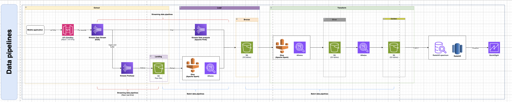
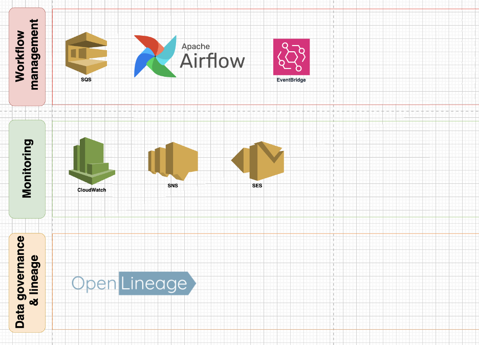
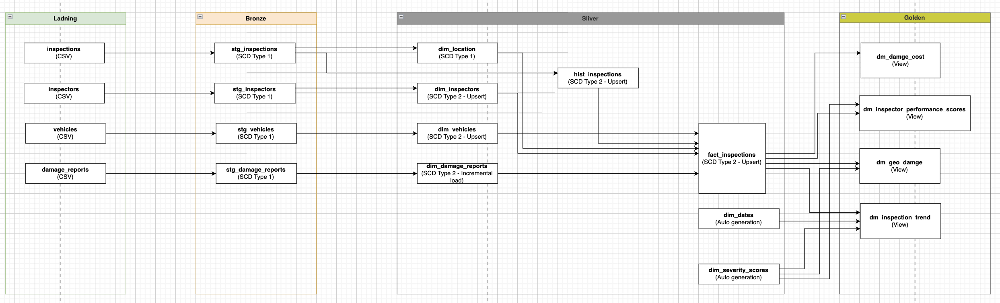

# Technical Design Document: Scalable Inspection Data Pipeline on AWS
## 1. Overview
This document outlines the technical design of a scalable, lakehouse-based data pipeline architecture on AWS for processing over 1 million vehicle inspections per month. The architecture ingests, processes, and transforms streaming and batch data—focusing on metadata from image-based inspection reports—to support analytics and visualization.

## 2. Solution architecture

Data pipelines diagrams:

Ohter layers:

### Streaming Ingestion
- **Amazon API Gateway + Kinesis Data Streams (KDS)**:
Enables ingestion of real-time inspection metadata from mobile apps via secure HTTPS. KDS buffers the records for downstream processing

- **Kinesis Data Firehose**:
Used to persist real-time stream data into S3 (Landing zone) for raw archival and batch processing.

- **Kinesis Data Analytics (Apache Flink)**:
Performs real-time stream analysis to enrich or filter metadata before it is delivered to the lake.

### Batch Processing
- **AWS Glue (Apache Spark)**: 
Used for scalable ETL across all data zones (Landing → Bronze → Silver → Gold). Handles large volumes of inspection metadata using PySpark.

- **Amazon Athena**:
Serverless SQL analytics engine that enables fast querying and transformation of data in S3 tables across lake zones.

### Lakehouse Storage
Lakhouse storage with *S3 tables (Iceberg tables)* with:
- **Landing**: Raw files from Firehose.
- **Bronze**: Cleaned and labeled metadata.
- **Silver**: Enriched, joined datasets.
- **Golden**: Business-ready datasets for BI tools.

Examples of data modeling in Lakehouse.

### Analytics & BI
- **Redshift Spectrum + Redshift**:
Redshift Spectrum enables querying data directly from S3; Redshift hosts aggregated, highly-performant tables for dashboards.

- **Amazon QuickSight**:
 Visualizes insights like inspector performance, inspection trends, or geographic damage patterns.

## 3. Data Flow
### Ingestion
Inspection metadata and image files are sent from the mobile app via API Gateway into Kinesis Data Stream.

KDS distributes data to:
- **Kinesis Data Analytics** (Flink) for enriching metadata in-flight (e.g., geolocation tagging, damage scoring).
- **Kinesis Firehose**, which delivers:
    - Metadata + image references to Landing (S3).
    - Images themselves (base64 or presigned URL payloads) to a designated S3 bucket for raw image storage.

### Storage Zones
**Landing**: Contains both raw metadata and associated image files (stored via Firehose).

**Bronze**: Metadata is parsed, validated, and linked to image paths.

**Silver**: Joins metadata with inspection context (e.g., inspector info).

**Golden**: Ready-to-query tables for analytics, each record linked to image files in S3.

### Query & BI
Athena supports ad hoc queries across all lake zones.

Redshift Spectrum reads from Golden zone for efficient joins.

QuickSight dashboards visualize insights using Redshift Spectrum.

### Handling of Image Metadata
This pipeline handles image metadata and image delivery:
- Image metadata includes: file name, capture timestamp, GPS, device info, damage labels, and inspector ID.

- Actual images are delivered via Kinesis Firehose to S3 (Landing Zone) and are not processed or transformed in this pipeline.

- Image files are referenced (e.g., via S3 URI) in downstream tables (Bronze/Silver/Golden), enabling efficient querying and downstream access without heavy storage in databases.

## 4. Scalability
**Streaming**:
- Kinesis can scale to handle thousands of PUTs/sec.
- Flink + Firehose scale horizontally for both real-time and bulk ingestion.

**Storage**:
- S3 provides infinite, cost-effective scalability for raw and curated data layers.
- Lakehouse zone structure (Landing → Bronze → Silver → Golden) ensures scalable, modular data growth.

**Processing**:
- AWS Glue auto-scales Spark jobs based on input size.
- Athena and Redshift Spectrum enable querying large datasets without overloading compute.

**Monitoring & Workflow**:
- CloudWatch, SNS, SES handle alerting and monitoring.
- Apache Airflow, EventBridge, and SQS manage pipeline orchestration.
- OpenLineage provides metadata tracking and data lineage governance.

## Key Highlights
- Hybrid architecture supports both streaming and batch pipelines.

- Modular Lakehouse zones for data lifecycle management.

- Focus on metadata processing enables high throughput without heavy image compute.

- Built-in governance and observability with OpenLineage and CloudWatch.

- Designed to handle 1M+ inspections/month with elasticity across AWS services.

