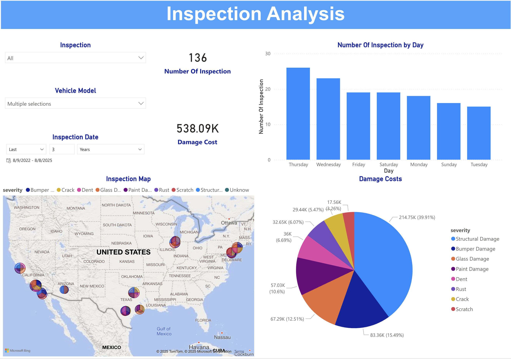
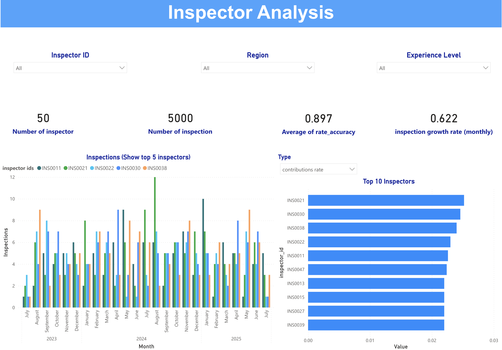

# Answers for part 2 (Analytics & Visualization)
**SQL Analytics Queries** and **Real-time Monitoring Queries**: Answers in `part3_sql_analytics.ipynb`.

## QuickSight Dashboard Mock-up
Attachs PowerBI file `part3_paveai_visualization_v2.pbix`. In this dashboard I generated 2 reports:

*Inspection Analysis*

*Inspector Analysis*
